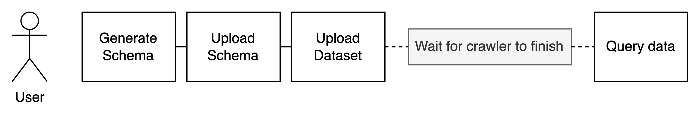
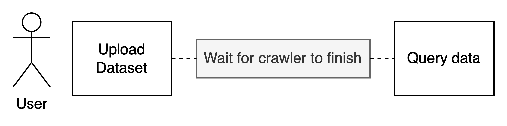

# rAPId API Usage Guide

The rAPId API serves to make data storage and retrieval consistent for all users involved.

Overarching API functionality includes:

- Uploading a schema
- Uploading data that matches that schema
- Listing available data
- Querying data
- Deleting data
- Creating programmatic clients

> ⚠️ Currently the **custom UI** only supports **uploading datasets**

## Application usage overview

The first step is to create a dataset by uploading a schema that describes the metadata including e.g.: data owner,
tags, partition columns, data types, etc..

Then the data (currently only `.csv` files are supported) can be uploaded to the dataset. During the upload process, the
service checks if the data matches the previously uploaded dataset schema definition.

During upload, a data 'crawler' is started which looks at the persisted data and infers some metadata about it. Once the
crawler has finished running (usually around 4-5 minutes) the data can be queried.

The application can be used by both human and programmatic clients (see more below)

- When accessing the REST API as a client application, different actions require the client to have different
  permissions e.g.:`READ`, `WRITE`, `DATA_ADMIN`, etc., and different dataset sensitivity level permissions
  e.g.: `PUBLIC`, `PRIVATE`, etc.
- When accessing the UI as a human user, permissions are granted by the permissions database, e.g.: `WRITE_PUBLIC`

## Data upload and query flows

### No schema exists + upload data + query



### Schema exists + upload data + query



# How to authorise

## Granting users permissions

For human users to access a certain dataset they need permission based on sensitivity levels.

This step is done via the permissions' database.

When creating a user app via the `/user` endpoint, permissions can be granted.

To update these, currently an admin will need to go to DynamoDB in the AWS console and manually grant or revoke the
relevant permission to the user (see [Adding/Deleting permissions](../contributing/application_context.md))

## Granting client apps permissions

When creating a client app via the `/client` endpoint, permissions can be granted.

To update these, currently an admin will need to go to DynamoDB in the AWS console and manually grant or revoke the
relevant permission to the client app (see [Adding/Deleting permissions](../contributing/application_context.md))

# Authenticating and interacting with the application

## Client app

### Using the OpenApi docs at `/docs`:

1. Hit Authorise button
2. Pass `client id` and `client secret`
3. Access the endpoints

### Via programmatic access:

See the [scripts](./scripts/) section for examples of programmatic client interaction.

The general concept is to retrieve an access token using client credentials and making subsequent requests passing that
token.

## Human user

### Via the UI

Clicking 'Login' on the `/login` page will redirect the user to Cognito, whereupon they will be prompted to enter their
username and password. This will grant them a temporary access token and redirect them to the `/upload` page.

# Endpoint usage

The following documents the usage of the available endpoints exposed by the REST API.

## Generate schema

In order to upload the dataset for the first time, you need to define its schema. This endpoint is provided for your
convenience to generate a schema based on an existing dataset. Alternatively you can consult
the [schema writing guide](schema_creation.md) if you would like to create the schema yourself. You can then use the
output of this endpoint in the Schema Upload endpoint.

### General structure

`POST /schema/{sensitivity}/{domain}/{dataset}/generate`

### Inputs

| Parameters    | Usage                                   | Example values               | Definition                 |
|---------------|-----------------------------------------|------------------------------|----------------------------|
| `sensitivity` | URL parameter                           | `PUBLIC, PRIVATE, PROTECTED` | sensitivity of the dataset |
| `domain`      | URL parameter                           | `land`                       | domain of the dataset      |
| `dataset`     | URL parameter                           | `train_journeys`             | dataset title              |
| `file`        | File in form data with key value `file` | `train_journeys.csv`         | the dataset file itself    |

### Outputs

Schema in json format in the response body:

```json
{
  "metadata": {
    "domain": "land",
    "dataset": "train_journeys",
    "sensitivity": "PUBLIC",
    "key_value_tags": {},
    "key_only_tags": [],
    "owners": [
      {
        "name": "change_me",
        "email": "change_me@email.com"
      }
    ]
  },
  "columns": [
    {
      "name": "date",
      "partition_index": 0,
      "data_type": "date",
      "format": "%d/%m/%Y",
      "allow_null": false
    },
    {
      "name": "num_journeys",
      "partition_index": null,
      "data_type": "Int64",
      "allow_null": false
    }
  ]
}
```

### Accepted permissions

In order to use this endpoint you don't need any scope.

### Examples

#### Example 1:

- Request url: `/schema/PRIVATE/land/train_journeys/generate`
- Form data: `file=train_journeys.csv`

#### Example 2:

- Request url: `/schema/PUBLIC/sea/ferry_crossings/generate`
- Form data: `file=ferry_crossings.csv`

## Upload schema

### General structure

When you have a schema definition you can use this endpoint to upload it. This will allow you to subsequently upload
datasets that match the schema. If you do not yet have a schema definition, you can craft this yourself (see
the [schema writing guide](schema_creation.md)) or use the Schema Generation endpoint (see above).

### General structure

`POST /schema`

### Inputs

| Parameters    | Usage                                   | Example values               | Definition            |
|---------------|-----------------------------------------|------------------------------|-----------------------|
| schema        | JSON request body                       | see below                    | the schema definition |

Example schema JSON body:

```json
{
  "metadata": {
    "domain": "land",
    "dataset": "train_journeys",
    "sensitivity": "PUBLIC",
    "key_value_tags": {
      "train": "passenger"
    },
    "key_only_tags": [
      "land"
    ],
    "owners": [
      {
        "name": "Stanley Shunpike",
        "email": "stan.shunpike@email.com"
      }
    ]
  },
  "columns": [
    {
      "name": "date",
      "partition_index": 0,
      "data_type": "date",
      "format": "%d/%m/%Y",
      "allow_null": false
    },
    {
      "name": "num_journeys",
      "partition_index": null,
      "data_type": "Int64",
      "allow_null": false
    }
  ]
}
```

### Outputs

None

### Accepted permissions

In order to use this endpoint you need the `DATA_ADMIN` scope.

## Upload dataset

Given a schema has been uploaded you can upload data which matches that schema. Uploading a CSV file via this endpoint
ensures that the data matches the schema and that it is consistent and sanitised. Should any errors be detected during
upload, these are sent back in the response to facilitate you fixing the issues.

### General structure

`POST /datasets/{domain}/{dataset}`

### Inputs

| Parameters    | Usage                                   | Example values               | Definition              |
|---------------|-----------------------------------------|------------------------------|-------------------------|
| `domain`      | URL parameter                           | `air`                        | domain of the dataset   |
| `dataset`     | URL parameter                           | `passengers_by_airport`      | dataset title           |
| `file`        | File in form data with key value `file` | `passengers_by_airport.csv`  | the dataset file itself |

### Output

If successful returns file name with a timestamp included, e.g.:

```json
{
  "uploaded": "2022-01-01T13:00:00-passengers_by_airport.csv"
}
```

### Accepted permissions

In order to use this endpoint you need a relevant `WRITE` permission that matches the dataset sensitivity level,
e.g.: `WRITE_ALL`, `WRITE_PUBLIC`, `WRITE_PRIVATE`, `WRITE_PROTECTED_{DOMAIN}`

### Examples

#### Example 1:

- Request url: `/datasets/land/train_journeys/`
- Form data: `file=train_journeys.csv`

#### Example 2:

- Request url: `/datasets/air/passengers_by_airport`
- Form data: `file=passengers_by_airport.csv`

## List datasets

Use this endpoint to retrieve a list of available datasets. You can also filter by the dataset sensitivity level or by
tags specified on the dataset.

If you do not specify any filter values, you will retrieve all available datasets.

### Filtering by tags

#### Filter by the tag key

To filter by tag only use the `"key_only_tags"` property, e.g., `"key_only_tags": ["school_type"]`

This will return all datasets which have this associated tag, regardless of the value of that tag, for example:

- dataset1 -> `school_type=private`
- dataset2 -> `school_type=public`
- dataset3 -> `school_type=home_school`

You can achieve the same by using `"key_value_tags"` property with null as a
value: ` "key_value_tags": {"school_type": null}`

#### Filter by the tag key AND value e.g.: `"key_value_tags": {"school_type": "private"}`

This will return all datasets which have this associated tag that _also_ has the specified value, for example:

- dataset1 -> `school_type=private`
- dataset2 -> `school_type=private`
- dataset3 -> `school_type=private`

### Filtering by sensitivity level

#### Filter by specific level e.g. `sensitivity: PUBLIC`

This will return all datasets which have this sensitivity level:

- dataset1 -> `sensitivity=PUBLIC`
- dataset2 -> `sensitivity=PUBLIC`
- dataset3 -> `sensitivity=PUBLIC`

You can also use `"key_value_tags"` to filter by sensitivity level, like this:
`"key_value_tags": {"sensitivity": "PUBLIC"}`

### General structure

`POST /datasets`

### Inputs

| Parameters    | Usage                                   | Example values      | Definition            |
|---------------|-----------------------------------------|---------------------|-----------------------|
| query         | JSON Request Body                       | see below           | the filtering query   |

### Output

Returns a list of datasets matching the query request, e.g.:

```json
[
  {
    "domain": "military",
    "dataset": "purchases",
    "tags": {
      "tag1": "weaponry",
      "sensitivity": "PUBLIC"
    }
  },
  {
    "domain": "military",
    "dataset": "armoury",
    "tags": {
      "tag1": "weaponry",
      "sensitivity": "PRIVATE"
    }
  }
]
```

If no dataset exists or none that matches the query, you will get an empty response, e.g.:

```json
[]
```

### Accepted permissions

You will always be able to list all available datasets, regardless of their sensitivity level, provided you have
a `READ` scope, e.g.: `READ_ALL`, `READ_PUBLIC`, `READ_PRIVATE`, `READ_PROTECTED_{DOMAIN}`

### Examples

#### Example 1 - No filtering:

- Request url: `/datasets`

#### Example 2 - Filtering by tags:

Here we retrieve all datasets that have a tag with key `tag1` with any value, and `tag2` with value `value2`

- Request url: `/datasets`
- JSON Body:

```json
{
  "key_value_tags": {
    "tag1": null,
    "tag2": "value2"
  }
}
```

#### Example 3 - Filtering by sensitivity:

- Request url: `/datasets`
- JSON Body:

```json
{
  "sensitivity": "PUBLIC"
}
```

#### Example 4 - Filtering by tags and sensitivity:

- Request url: `/datasets`
- JSON Body:

```json
{
  "sensitivity": "PUBLIC",
  "key_value_tags": {
    "tag1": null,
    "tag2": "value2"
  }
}

```

#### Example 4 - Filtering by key value tags and key only tags:

- Request url: `/datasets`
- JSON Body:

```json
{
  "sensitivity": "PUBLIC",
  "key_value_tags": {
    "tag2": "value2"
  },
  "key_only_tags": [
    "tag1"
  ]
}

```

This example has the same effect as Example 3.

## Dataset info

Use this endpoint to retrieve basic information for specific datasets, if there is no data stored for the dataset and
error will be thrown.

When a valid dataset is retrieved the available data will be the schema definition with some extra values such as:

- number of rows
- number of columns
- statistics data for date columns

### General structure

`GET /datasets/{domain}/{dataset}/info`

### Inputs

| Parameters    | Usage                                   | Example values               | Definition            |
|---------------|-----------------------------------------|------------------------------|-----------------------|
| `domain`      | URL parameter                           | `land`                       | domain of the dataset |
| `dataset`     | URL parameter                           | `train_journeys`             | dataset title         |

### Outputs

Schema in json format in the response body:

```json
{
  "metadata": {
    "domain": "dot",
    "dataset": "trains_departures",
    "sensitivity": "PUBLIC",
    "tags": {},
    "owners": [
      {
        "name": "user_name",
        "email": "user@email.email"
      }
    ],
    "number_of_rows": 123,
    "number_of_columns": 2,
    "last_updated": "2022-03-01 11:03:49+00:00"
  },
  "columns": [
    {
      "name": "date",
      "partition_index": 0,
      "data_type": "date",
      "format": "%d/%m/%Y",
      "allow_null": false,
      "statistics": {
        "max": "2021-07-01",
        "min": "2014-01-01"
      }
    },
    {
      "name": "num_journeys",
      "partition_index": null,
      "data_type": "Int64",
      "allow_null": false,
      "statistics": null
    }
  ]
}
```

### Accepted permissions

You will always be able to get info on all available datasets, regardless of their sensitivity level, provided you have
a `READ` scope, e.g.: `READ_ALL`, `READ_PUBLIC`, `READ_PRIVATE`, `READ_PROTECTED_{DOMAIN}`

### Examples

#### Example 1:

- Request url: `/datasets/land/train_journeys/info`

## List Raw Files

Use this endpoint to retrieve all raw files linked to a specific domain/dataset, if there is no data stored for the
domain/dataset an error will be thrown.

When a valid domain/dataset is retrieved the available raw file uploads will be displayed in list format.

### General structure

`GET /datasets/{domain}/{dataset}/files`

### Inputs

| Parameters    | Usage                                   | Example values               | Definition            |
|---------------|-----------------------------------------|------------------------------|-----------------------|
| `domain`      | URL parameter                           | `land`                       | domain of the dataset |
| `dataset`     | URL parameter                           | `train_journeys`             | dataset title         |

### Outputs

List of raw files in json format in the response body:

```json
[
  "2022-01-21T17:12:31-file1.csv",
  "2022-01-24T11:43:28-file2.csv"
]
```

### Accepted permissions

You will always be able to get info on all available datasets, regardless of their sensitivity level, provided you have
a `READ` scope, e.g.: `READ_ALL`, `READ_PUBLIC`, `READ_PRIVATE`, `READ_PROTECTED_{DOMAIN}`

### Examples

#### Example 1:

- Request url: `/datasets/land/train_journeys/files`

## Delete Data File

Use this endpoint to delete raw files linked to a specific domain/dataset, if there is no data stored for the
domain/dataset or the file name is invalid an error will be thrown.

When a valid file in the domain/dataset is deleted success message will be displayed

### General structure

`GET /datasets/{domain}/{dataset}/{filename}`

### Inputs

| Parameters | Usage                                   | Example values                  | Definition                    |
|------------|-----------------------------------------|---------------------------------|-------------------------------|
| `domain`   | URL parameter                           | `land`                          | domain of the dataset         |
| `dataset`  | URL parameter                           | `train_journeys`                | dataset title                 |
| `filename` | URL parameter                           | `2022-01-21T17:12:31-file1.csv` | previously uploaded file name |

### Accepted permissions

In order to use this endpoint you need a relevant WRITE scope that matches the dataset sensitivity level,
e.g.: `WRITE_ALL`, `WRITE_PUBLIC`, `WRITE_PUBLIC`, `WRITE_PROTECTED_{DOMAIN}`

### Examples

#### Example 1:

- Request url: `/datasets/land/train_journeys/2022-01-21T17:12:31-file1.csv`

## Query dataset

Data can be queried provided data has been uploaded at some point in the past and the 'crawler' has completed its run.

### General structure

`POST /datasets/{domain}/{dataset}/query`

### Inputs

| Parameters    | Required     | Usage                   | Example values             | Definition                    |
|---------------|--------------|-------------------------|----------------------------|-------------------------------|
| `domain`      | True         | URL parameter           | `space`                    | domain of the dataset         |
| `dataset`     | True         | URL parameter           | `rocket_lauches` | dataset title                 |
| `query`       | False        | JSON Request Body       | see below                  | the query object              |

#### How to construct a query object:

There are six values you can customise:

- `select_columns`
    - Which column(s) you want to select
    - List of strings
    - Can contain aggregation functions e.g.: `"avg(col1)"`, `"sum(col2)"`
    - Can contain renaming of columns e.g.: `"col1 AS custom_name"`
- `filter`
    - How to filter the data
    - This is provided as a raw SQL string
    - Omit the `WHERE` keyword
- `group_by_columns`
    - Which columns to group by
    - List of column names as strings
- `aggregation_conditions`
    - What conditions you want to apply to aggregated values
    - This is provided as a raw SQL string
    - Omit the `HAVING` keyword
- `order_by_columns`
    - By which column(s) to order the data
    - List of strings
    - Defaults to ascending (`ASC`) if not provided
- `limit`
    - How many rows to limit the results to
    - String of an integer

For example:

```json
{
  "select_columns": [
    "col1",
    "avg(col2)"
  ],
  "filter": "col2 >= 10",
  "group_by_columns": [
    "col1"
  ],
  "aggregation_conditions": "avg(col2) <= 15",
  "order_by_columns": [
    {
      "column": "col1",
      "direction": "DESC"
    },
    {
      "column": "col2",
      "direction": "ASC"
    }
  ],
  "limit": "30"
}
```

> ⚠️ Note:
>
> If you do not specify a customised query, and only provide the domain and dataset, you will **select the entire dataset**

### Outputs

#### JSON

By default, the result of the query are returned in JSON format where each key represents a row, e.g.:

```json
{
  "0": {
    "column1": "value1",
    "column2": "value2"
  },
  "2": {
    "column1": "value3",
    "column2": "value4"
  },
  "3": {
    "column1": "value5",
    "column2": "value6"
  }
}
```

#### CSV

To get a CSV response, the `Accept` Header has to be set to `text/csv`. The response will come as a table, e.g.:

```csv
"","column1","column2"
0,"value1","value2"
1,"value3","value4"
3,"value5","value6"
```

### Accepted permissions

In order to use this endpoint you need a `READ` scope with appropriate sensitivity level permission,
e.g.: `READ_PRIVATE`.

### Examples

#### Example 1 - Full dataset - JSON:

- Request url: `/datasets/land/train_journeys/query`

#### Example 2 - Full dataset - CSV:

- Request url: `/datasets/land/train_journeys/query`
- Request headers: `"Accept":"text/csv"`

#### Example 3 - Dataset filtered by date and ordered by column:

- Request url: `/datasets/space/rocket_lauches/query`
- Request Body:

```json
{
  "filter": "date >= '2020-01-01' AND date <= '2020-02-01'",
  "order_by_columns": [
    {
      "column": "launch_date"
    }
  ]
}
```

#### Example 4 - Specific columns, aggregation on values after grouping and limiting results:

In this example we get the average rocket payload for rockets in a certain class where that average payload is heavier
than 5000kg.

- Request url: `/datasets/space/rocket_launches/query`
- Request Body:

```json
{
  "select_columns": [
    "rocket_class",
    "avg(payload_weight)"
  ],
  "filter": "rocket_class in ('mini', 'medium', 'large', 'heavyweight')",
  "group_by_columns": [
    "rocket_class"
  ],
  "aggregation_conditions": "avg(payload_weight) > 5000",
  "limit": "10"
}
```

## Create client

As a maintainer of a rAPId instance you may want to allow new clients to interact with the API to upload or query data.

Use this endpoint to add a new client and generate their client credentials.

### General structure

`POST /client`

### Inputs

| Parameters       | Usage               | Example values   | Definition                                                                |
|------------------|---------------------|------------------|---------------------------------------------------------------------------|
| `client details` | JSON Request Body   | See below        | The name of the client application to onboard and the granted permissions |

```json
{
  "client_name": "department_for_education",
  "permissions": [
    "READ_ALL",
    "WRITE_PUBLIC"
  ]
}
```

### Client Name

The client name must adhere to the following conditions:

- Alphanumeric
- Start with an alphabetic character
- Can contain any symbol of `. - _ @`
- Must be between 3 and 128 characters

#### Permissions you can grant to the client

Depending on what permission you would like to grant the onboarding client, the relevant permission(s) must be assigned.
Available choices are:

- `READ_ALL` - allow client to read any dataset
- `READ_PUBLIC` - allow client to read any public dataset
- `READ_PRIVATE` - allow client to read any dataset with sensitivity private or public
- `READ_PROTECTED_{DOMAIN}` - allow client to read datasets within a specific protected domain
- `WRITE_ALL` - allow client to write any dataset
- `WRITE_PUBLIC` - allow client to write any public dataset
- `WRITE_PRIVATE` - allow client to write any dataset with sensitivity private or public
- `WRITE_PROTECTED_{DOMAIN}` - allow client to write datasets within a specific protected domain
- `DATA_ADMIN` - allow client to add a schema for a dataset of any sensitivity
- `USER_ADMIN` - allow client to add a new client

The protected domains can be listed [here](#list-protected-domains) or created [here](#create-protected-domain).

### Outputs

Once the new client has been created, the following information is returned in the response:

```json
{
  "client_name": "department_for_education",
  "permissions": [
    "READ_ALL",
    "WRITE_PUBLIC"
  ],
  "client_id": "1234567890-abcdefghijk",
  "client_secret": "987654321"
}
```

### Accepted permissions

In order to use this endpoint you need the `USER_ADMIN` permission

## Delete Client

Use this endpoint to list all available permissions that can be granted to users and clients.

### General structure

`DELETE /client/{client_id}`

### Outputs

Confirmation Message:

```json
{
  "message": "The client '{client_id}' has been deleted"
}
```

### Accepted permissions

In order to use this endpoint you need the `USER_ADMIN` scope

## Create user

As a maintainer of a rAPId instance you may want to allow new users to interact with the UI to upload or query data.

Use this endpoint to add a new users, generate their credentials and add permissions to them.

### General structure

`POST /user`

### Inputs

| Parameters       | Usage               | Example values   | Definition                                                                |
  |------------------|---------------------|------------------|---------------------------------------------------------------------------|
| `User details`   | JSON Request Body   | See below        | The name of the user application to onboard and the granted permissions   |

  ```json
  {
  "username": "jhon_doe",
  "email": "jhon.doe@email.com",
  "permissions": [
    "READ_ALL",
    "WRITE_PUBLIC"
  ]
}
  ```

### Username

The username must adhere to the following conditions:

- Alphanumeric
- Start with an alphabetic character
- Can contain any symbol of `. - _ @`
- Must be between 3 and 128 characters

### Email address

The email must adhere to the following conditions:

- The domain must be included on the `ALLOWED_EMAIL_DOMAINS` environment
- Must satisfy the Email Standard Structure `RFC5322` (
  see [Email Address in Wikipedia](https://en.wikipedia.org/wiki/Email_address))

#### Permissions you can grant to the client

Depending on what permission you would like to grant the on-boarding user, the relevant permission(s) must be assigned.
Available choices are:

- `READ_ALL` - allow user to read any dataset
- `READ_PUBLIC` - allow user to read any public dataset
- `READ_PRIVATE` - allow user to read any dataset with sensitivity private or public
- `READ_PROTECTED_{DOMAIN}` - allow user to read datasets within a specific protected domain
- `WRITE_ALL` - allow user to write any dataset
- `WRITE_PUBLIC` - allow user to write any public dataset
- `WRITE_PRIVATE` - allow user to write any dataset with sensitivity private or public
- `WRITE_PROTECTED_{DOMAIN}` - allow user to write datasets within a specific protected domain
- `DATA_ADMIN` - allow user to add a schema for a dataset of any sensitivity
- `USER_ADMIN` - allow user to add a new user

  The protected domains can be listed [here](#Protected%20Domains/list_protected_domains_protected_domains_get) or created [here](#Protected%20Domains/create_protected_domain_protected_domains__domain__post).

### Outputs

Once the new user has been created, the following information will be shown in the response:

```json
{
  "username": "jhon_doe",
  "email": "jhon.doe@email.com",
  "permissions": [
    "READ_ALL",
    "WRITE_PUBLIC"
  ],
  "user_id": "some-generated-id-eq2e3q-eqwe32-12eqwe214q"
}
```

### Accepted permissions

In order to use this endpoint you need the `USER_ADMIN` permission

## Delete User

Use this endpoint to list all available permissions that can be granted to users and clients.

### General structure

`DELETE /user`

### Inputs

| Parameters       | Usage               | Example values   | Definition                            |
|------------------|---------------------|------------------|---------------------------------------|
| `user details`   | JSON Request Body   | See below        | The name and id of the user to delete |

```json
{
  "username": "John Doe",
  "user_id": "some-uuid-generated-string-asdasd0-2133"
}
```

### Outputs

Confirmation Message:

```json
{
  "message": "The user '{username}' has been deleted"
}
```

### Accepted permissions

In order to use this endpoint you need the `USER_ADMIN` scope


## Create protected domain

Protected domains can be created to restrict access permissions to specific domains

Use this endpoint to create a new protected domain. After this you can create clients with the permission for this
domain and create `PROTECTED` datasets within this domain.

### General structure

`POST /protected_domains/{domain}`

### Inputs

| Parameters       | Usage               | Example values   | Definition                                                           |
|------------------|---------------------|------------------|----------------------------------------------------------------------|
| `domain` | URL Parameter  | `land`        | The name of the protected domain |

### Domain

The domain name must adhere to the following conditions:

- Alphanumeric
- Start with an alphabetic character
- Can contain any symbol of `- _`

### Outputs

None

### Accepted permission

In order to use this endpoint you need the `DATA_ADMIN` scope

## List protected domains

Use this endpoint to list the protected domains that currently exist.

### General structure

`GET /protected_domains`

### Outputs

List of protected scopes in json format in the response body:

```json
[
  "land",
  "department"
]
```

### Accepted permissions

In order to use this endpoint you need the `DATA_ADMIN` scope

## List permissions

Use this endpoint to list all available permissions that can be granted to users and clients.

### General structure

`GET /permissions`

### Outputs

List of permissions:

```json
[
  "DATA_ADMIN",
  "USER_ADMIN",
  "WRITE_ALL",
  "READ_PROTECTED_<domain>",
  "..."
]
```

### Accepted permissions

In order to use this endpoint you need the `USER_ADMIN` scope


## List subject permissions

Use this endpoint to list all permissions that are assigned to a subject.

### General structure

`GET /permissions/{subject_id}`

### Outputs

List of permissions:

```json
[
  "DATA_ADMIN",
  "USER_ADMIN",
  "WRITE_ALL",
  "READ_PROTECTED_<domain>",
  "..."
]
```

### Accepted permissions

In order to use this endpoint you need the `USER_ADMIN` permission


# UI usage

## Login

This page is used to authenticate users.

### General structure

`GET /login`

### Needed credentials

None

### Steps

1) Go to ```/login```
2) Click on "Log in to rAPId"
3) Wait to be redirected to Cognito
4) Type username and password
5) Click on "Log in"
6) Wait to be redirected to ```/upload```

## Logout

This endpoint is used to remove the user's credentials

### General structure

`GET /logout`

### Needed credentials

None

### Steps - On upload page

1) Go to ```/upload``` as an authenticated user
2) Click on "Log out"
3) Wait to be redirected to ```/login```

### Steps - On the browser

1) Go to ```/logout``` as an authenticated user
2) Wait to be redirected to ```/login```

## Upload

This page is used to upload datasets into the rAPId service by authenticated users.

### General structure

`GET /upload`

### Needed credentials

The user must be logged in as a Cognito user to use this page. The credentials will be read from the cookie "rat" that
stands for "Rapid Access Token".

For example, if the user has permission "READ_PRIVATE", "WRITE_PRIVATE" and "dot/trucks" dataset has the sensitivity of
PRIVATE (or PUBLIC) then they will be able to see and write to the datasets "dot/trucks".

If the user is missing any permissions, they can be added in the permissions database.

### Steps

To upload dataset just follow these simple steps.

1) Log in
2) Go to ```/upload```
3) Select a dataset from the list
4) Choose a valid file for the selected dataset
5) Click on upload button

### Response

When uploading the datasets there are 2 possible responses:

- Success: A message with the uploaded filename will be shown to the user
- Failure: An error message will be shown to the user
